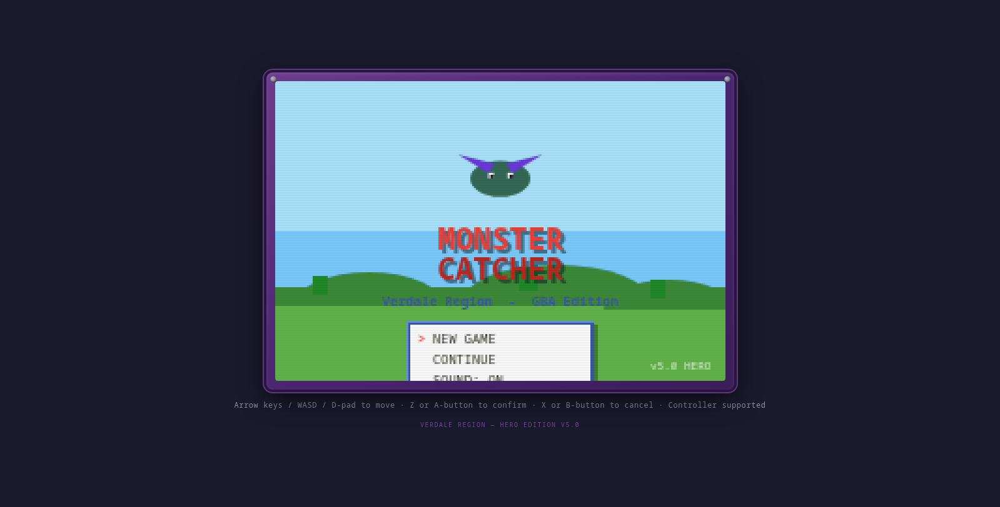
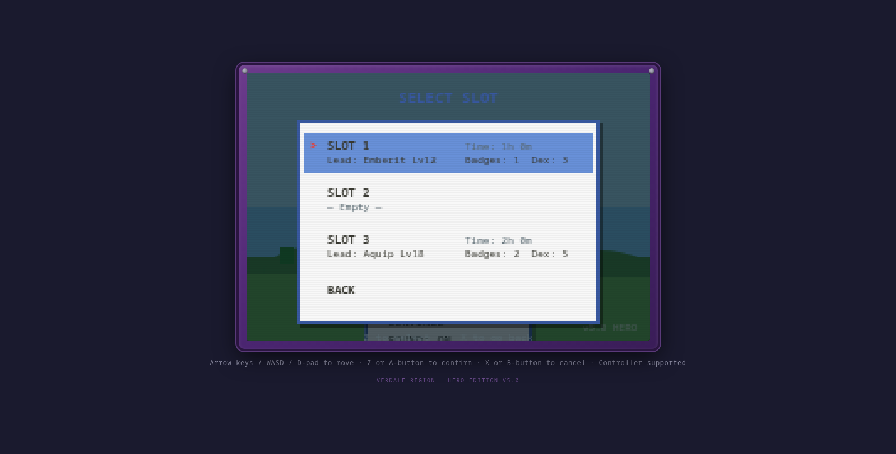
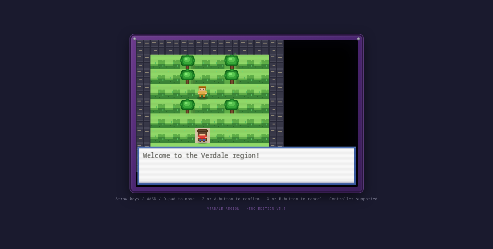
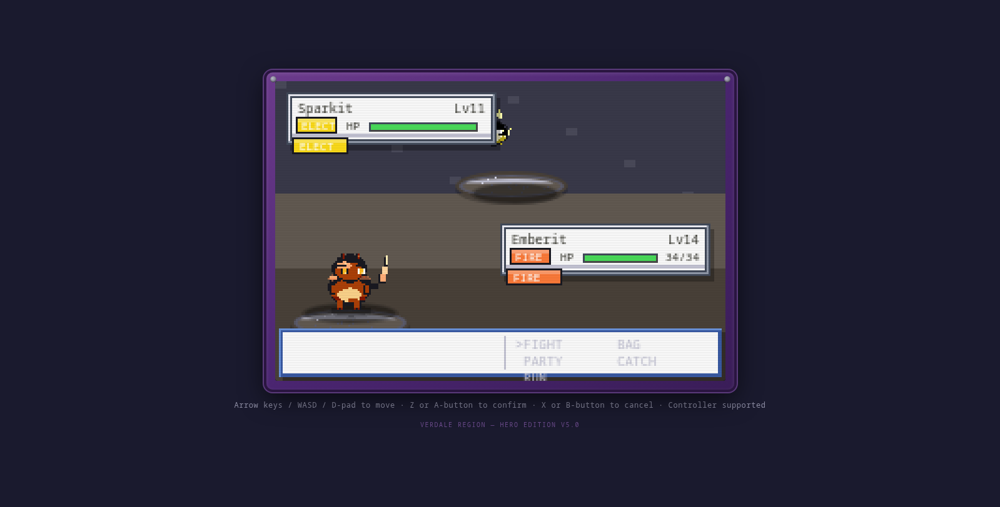
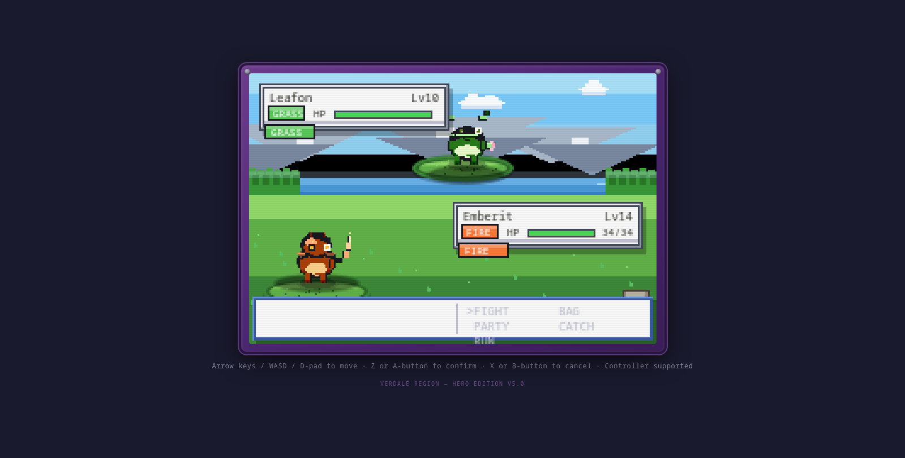
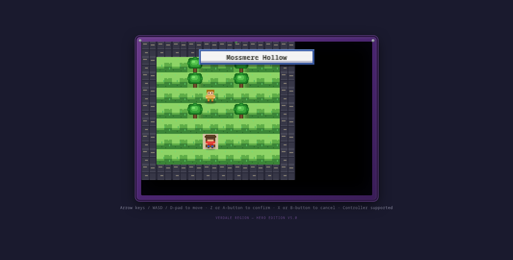
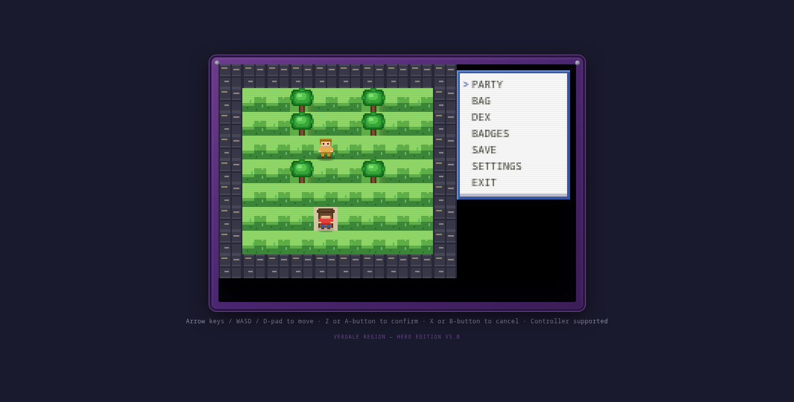
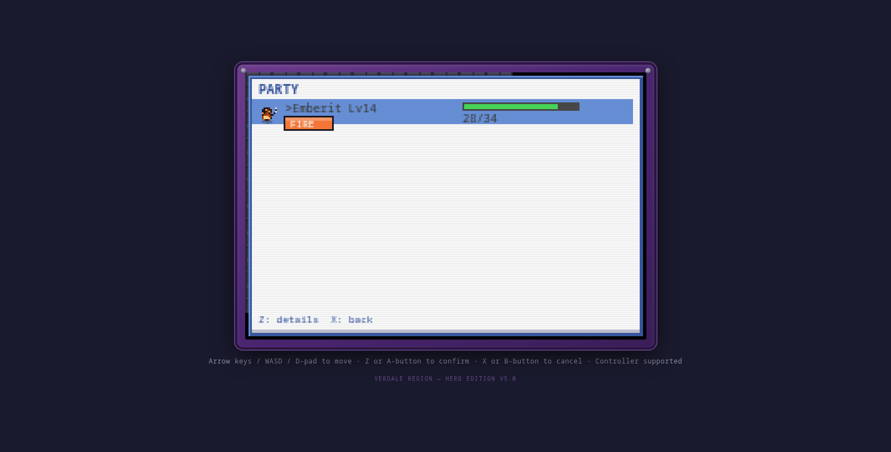
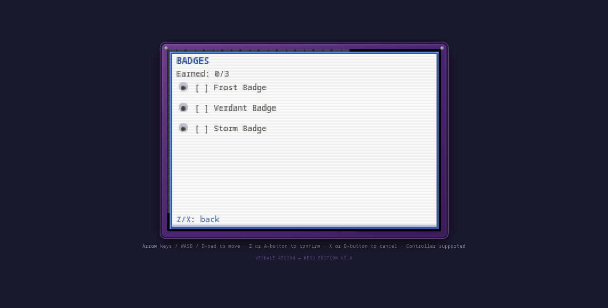
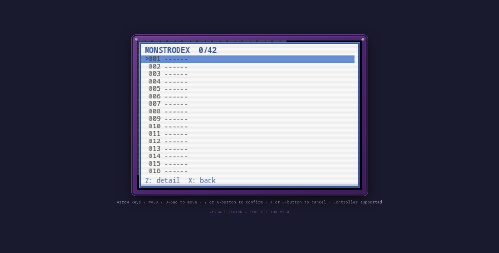

# 🎮 Monster Catcher — Verdale Region: HERO Edition v5.0


> A complete, original monster-catching RPG built from scratch in pure HTML5 Canvas + JavaScript — no game engine, no frameworks, no external sprite assets. Every pixel is drawn procedurally at runtime. Runs in any modern browser **or** as a native desktop app via Electron.



---

## 📖 What Is This?

**Monster Catcher — Verdale Region** is a fully-playable, Game Boy Advance–style monster catching RPG inspired by the golden era of handheld RPGs. It features a complete single-player adventure across 21 interconnected maps, 42 unique creature species with 22 evolution lines, a deep turn-based battle system with 102 moves and 6 elemental types, a multi-phase boss battle with three possible endings, a branching comedy dialogue system, and a whole suite of quality-of-life features that make it feel like a real released game.

The entire project is **~15,800 lines of hand-written JavaScript** spread across 22 modules, plus HTML and CSS. There are **no image files** — every creature, tile, building, UI element, and effect is rendered pixel-by-pixel on an HTML5 Canvas at the GBA's native 240×160 resolution, then upscaled with crisp `image-rendering: pixelated` scaling for that authentic retro look.

This is the **HERO Edition (v5.0)** — the biggest upgrade yet, adding a full particle engine, screen effects system, gamepad/controller support, a multi-slot save system with auto-save, and polished UI throughout.

---

## ✨ Features

### Core Game
- **42 unique monster species** across 22 evolution lines, each with hand-designed procedural sprites (64×64 pixel art drawn via Canvas 2D)
- **102 battle moves** with full type effectiveness, STAB bonuses, critical hits, status effects (burn, poison, paralysis, sleep, freeze, confusion, toxic), and stat-stage modifications
- **6 elemental types** — Pyro (fire), Aqua (water), Verdant (grass), Volt (electric), Terra (ground), Frost (ice), plus Shadow, Cyber, Magic, and Junk as special boss-region elements
- **Turn-based battle system** with party switching, in-battle items, multiple ball types for catching, XP sharing across party, level-ups, evolution sequences, and move learning
- **21 interconnected maps** spanning towns, routes, caves, a volcano, a cyber-city, a crystal forest, a junk wasteland, glacial peaks, an abyssal trench, a stormy savanna, and a moonlight marsh
- **3 gym badges** to earn (Frost, Verdant, Storm) with gym leader battles
- **Multi-phase boss battle** against Giga-Thok the Treasure Golem, featuring 4 battle phases, unique dialogue per phase, special mechanics, and **3 different endings** (spare, defeat, or hug)
- **Branching comedy dialogue system** with player choice branches, party banter, fourth-wall-breaking humor, and contextual location-based dialogue
- **10 creature quirks** — personality traits like "Snack-Obsessed," "Overly Dramatic," "Fourth-Wall Breaker," and "Chaos Agent" that affect gameplay and dialogue

### HERO Edition v5.0 Additions
- **Particle engine** (`particles.js`) — 10 particle types (sparks, embers, sparkles, hit stars, smoke, dust, splashes, fireflies, leaves, rings) used for battle hit effects, catch success bursts, level-up celebrations, faint smoke, grass step puffs, water splashes, ambient fireflies at night, and falling leaves in forests
- **Screen effects system** (`effects.js`) — full-screen color flashes, GBA-style zebra-stripe battle transition wipes, battle hit flashes, healing sparkles, floating combat text ("CRITICAL!", "SUPER EFFECTIVE!", "LEVEL UP!"), and area name popups when entering new maps
- **Full gamepad/controller support** (`gamepad.js`) — Gamepad API integration with D-pad and analog stick support, deadzone calibration, edge detection for button presses, and auto-repeat for movement. Play the entire game with a controller
- **Multi-slot save system** — 3 save slots plus auto-save, with rich metadata display (party lead, level, badges earned, dex completion, playtime). Auto-saves on map transitions and after battles
- **Polished UI** — animated title screen with drifting particles, controller connection indicator, area name popups, healing visual feedback, and refined menu styling throughout

### Technical
- **Procedural pixel-art rendering** — zero external image dependencies; everything is drawn via Canvas 2D `fillRect` and custom pixel routines
- **GBA-native resolution** (240×160) upscaled to 720×480 (3×) with pixel-perfect scaling
- **Tile-based overworld** with 16×16 tiles, 15×10 visible viewport, day/night cycle with ambient particle effects
- **Layered battle backgrounds** with textured platforms, type-colored HP boxes with element badges, and dynamic battle animations (shake, flash, slide, particle bursts)
- **Synthesized audio** — 20+ sound effects generated procedurally via the Web Audio API (no audio files needed)
- **Desktop packaging** via Electron with a GBA-styled window chrome

---

## 🕹️ Controls

| Action | Keyboard | Controller |
|--------|----------|------------|
| Move | Arrow keys / WASD | D-pad / Left stick |
| Confirm / Interact | Z or Enter | A button |
| Cancel / Back | X or Esc | B button |
| Open Menu | Enter | Start button |
| Navigate menus | Arrow keys / WASD | D-pad / Left stick |

The game automatically detects connected controllers and displays a "🎮 Connected" indicator on the title screen.

---

## 🚀 How to Run

### Option 1: Play in a Browser (Quick Start)

No build step required. Just serve the directory with any static file server:

```bash
# Using Python (comes pre-installed on most systems)
cd monstercatcher
python3 -m http.server 9090

# Then open your browser to:
# http://localhost:9090/
```

Or with Node.js:
```bash
npx serve .
```

Or simply open `index.html` directly in a modern browser (Chrome, Firefox, Edge, Safari).

> **Note:** The save system uses `localStorage`, which works best when served over `http://` rather than `file://`. Use the server method for the full experience.

### Option 2: Run as a Desktop App (Electron)

For the authentic GBA-handheld experience with a native window:

```bash
cd monstercatcher
npm install        # installs Electron
npm start          # launches the game in a desktop window
```

The Electron window is styled to resemble a Game Boy Advance, with a fixed 820×620 resolution and a dark console bezel.

**Requirements:** Node.js 18+ and npm.

---

## 🌍 The World of Verdale

### The Story

You are a young hero setting out from **Mossmere Hollow**, a quiet village in the lush Verdale Region. Professor Alder Thorne, the region's foremost creature researcher, has noticed strange disturbances — ancient biomes long thought dormant are awakening, and wild creatures are growing restless. Something is stirring in the **Forgotten Junk Wasteland**, where the legendary treasure golem **Giga-Thok** slumbers atop a hoard of forgotten relics.

Your journey takes you across 21 distinct locations: from the gentle **Route 1** meadows to the scorching interior of a live **Volcano**, through a neon-lit **Cyber City**, an **Enchanted Crystal Forest** pulsing with magic, the frozen **Glacial Peak Mountains**, the lightless **Abyssal Trench**, the electric **Stormy Savanna**, and the ethereal **Moonlight Marsh**. Along the way, you'll challenge **3 gym leaders** for the Frost, Verdant, and Storm badges, build a team of up to 6 creatures, and ultimately confront Giga-Thok in a **4-phase boss battle** with three possible outcomes — will you spare it, defeat it, or... hug it?

### The Creatures

The Verdale Region is home to **42 unique species** across **22 evolution lines**. Each creature is procedurally rendered at 64×64 pixels — no two species share the same silhouette. Starter choices include:

- **Emberit → Infernyx → Pyrothorn** — the Pyro line, a fiery lizard that grows into a dragon
- **Aquip → Tidalon → Leviathorn** — the Aqua line, an amphibious serpent of growing power
- **Leafon → Florahn → Thornheart** — the Verdant line, a leafy guardian of the forests

Beyond the starters, you'll discover electric rodents, rocky moles, icy sprites, ghostly wisps, psychic drills, venomous moths, soaring galewings, and more — each with their own stats, abilities, move pools, and personality quirks.

### The Humor

This isn't just a serious RPG — it's genuinely funny. The branching dialogue system features a self-aware hero who breaks the fourth wall, party members who argue about tactical decisions, creatures with personality quirks like "Overly Dramatic" and "Compulsive Hoarder," and dialogue choices that lead to absurd outcomes. The comedy is woven into the game's DNA, from NPC banter to boss fight quips to the quirk system that makes every creature feel alive.

---

## 📸 Screenshots

### Title Screen

*The animated title screen with drifting sparkle particles and the main menu. Shows the "🎮 Connected" indicator when a controller is detected.*

### Save Slot Selection

*Three save slots with rich metadata — party lead, level, badges earned, dex completion, and playtime. The HERO Edition's multi-slot save system.*

### Overworld Exploration

*The tile-based overworld at GBA-native resolution. Trees, grass, buildings, and the player character — all procedurally rendered.*

### Battle System

*Turn-based battle with layered backgrounds, textured platforms, HP boxes with type badges, and the full battle menu (FIGHT, BAG, PARTY, CATCH, RUN).*

### Battle with Particle Effects

*The HERO Edition particle engine in action — hit stars, sparkles, and floating combat text ("SUPER EFFECTIVE!") burst on impact during battles.*

### Area Name Popup

*The area name popup fades in when entering a new map, accompanied by a healing flash effect.*

### Main Menu

*The in-game menu — Party, Bag, Dex, Badges, Save, Settings, Exit.*

### Party Screen

*View your team with sprites, levels, HP bars, and type badges.*

### Badge Collection

*Track your gym badge progress — Frost, Verdant, and Storm badges to earn.*

### Monstrodex

*The Monstrodex tracks all 42 species you've seen and caught across the Verdale region.*

---

## 🏗️ Architecture

The game is built as a collection of vanilla JavaScript modules loaded via `<script>` tags in `index.html`. No bundler, no transpiler, no dependencies (except Electron for the desktop wrapper).

```
monstercatcher/
├── index.html              # Entry point — loads all modules
├── style.css               # CRT/GBA styling, canvas scaling, layout
├── package.json            # Electron config & scripts
├── electron/
│   └── main.js             # Electron main process (desktop window)
├── screenshots/            # Game screenshots for this README
├── assets/
│   └── sprites/            # (Empty — sprites are procedural, not PNGs)
└── js/
    ├── constants.js        # Screen dims, tile size, color palette, game states
    ├── palettes.js         # Theme palettes & color ramps
    ├── elements.js         # Elemental type definitions, abilities, ultimates
    ├── monsters.js         # Species data, moves, items, stats, evolution
    ├── sprites.js          # Procedural sprite rendering engine (64×64)
    ├── world.js            # 21 maps, tile definitions, warp connections
    ├── biomes.js           # Special biome zones with weather effects
    ├── player.js           # Player state, movement, save/load system
    ├── worldcreatures.js   # Overworld NPCs, encounters, staring contests
    ├── battle.js           # Turn-based battle engine (moves, damage, AI)
    ├── boss.js             # Giga-Thok multi-phase boss battle
    ├── menu.js             # In-game menus (party, bag, dex, save, settings)
    ├── dialogue.js         # Branching dialogue & comedy system
    ├── story.js            # Main story progression & badge logic
    ├── characters.js       # NPC definitions & character data
    ├── quirks.js           # Creature personality quirks
    ├── powerups.js         # Items, equipment, and power-ups
    ├── particles.js        # Particle engine (NEW in v5.0)
    ├── effects.js          # Screen effects & floating text (NEW in v5.0)
    ├── gamepad.js          # Controller input support (NEW in v5.0)
    ├── audio.js            # Procedural Web Audio sound effects
    └── main.js             # Main game loop, state machine, rendering
```

### Rendering Pipeline

The game runs at the GBA's native 240×160 pixel resolution. Every frame:

1. The main loop (`main.js`) ticks game logic based on the current state (title, overworld, battle, menu)
2. The appropriate draw function renders to a 240×160 offscreen canvas using Canvas 2D primitives (`fillRect`, custom pixel routines)
3. The 240×160 canvas is drawn scaled 3× to the visible 720×480 canvas with `image-rendering: pixelated` for crisp upscaling
4. Particle and screen effects layers are composited on top
5. The final canvas is presented to the user via the browser or Electron window

### Save System

Saves use `localStorage` with the following keys:
- `monsterCatcher_save_v5_slot_1` through `monsterCatcher_save_v5_slot_3` — manual save slots
- `monsterCatcher_save_v5_auto` — auto-save (triggered on map transitions and after battles)

Each save contains the full game state: party, bag, dex, badges, player position, playtime, and story flags. The save metadata (party lead, level, badges, dex count, playtime) is extracted for display on the slot selection screen.

---

## 🎯 Game Content at a Glance

| Category | Count |
|----------|-------|
| Monster species | 42 |
| Evolution lines | 22 |
| Battle moves | 102 |
| Elemental types | 10+ |
| Maps / locations | 21 |
| Gym badges | 3 |
| Items & power-ups | 35 |
| Creature quirks | 10 |
| Boss phases | 4 (with 3 endings) |
| Sound effects | 20+ |
| Particle types | 10 |
| Save slots | 3 + auto-save |
| Total code lines | ~15,800 |

---

## 🛠️ Development

### Running locally for development

```bash
cd monstercatcher
python3 -m http.server 9090
# Open http://localhost:9090/ in your browser
```

### Syntax checking all modules

```bash
for f in js/*.js; do node --check "$f" && echo "OK: $f"; done
```

### Building the desktop app

```bash
cd monstercatcher
npm install
npm start          # Run in development
```

To package for distribution (Windows/macOS/Linux), install `electron-builder` or `electron-packager` and configure build targets in `package.json`.

---

## 📜 License

This project is licensed under the **MIT License** — see the [LICENSE](LICENSE) file for details.

You are free to use, modify, distribute, and build upon this code for any purpose, commercial or non-commercial, as long as the original copyright notice and license text are included.

---

## 🙏 Credits

**Monster Catcher — Verdale Region: HERO Edition v5.0**

A passion project built to demonstrate that a complete, polished, retro-style RPG can be created from scratch using nothing but vanilla web technologies — no game engines, no frameworks, no external art assets. Every pixel, every sound, and every line of code was crafted to prove that the web platform is a fully-capable game development environment.

Built with ❤️ and a love for the GBA era.

---

*Verdale Region — HERO Edition v5.0 · "Every pixel, hand-placed."*
